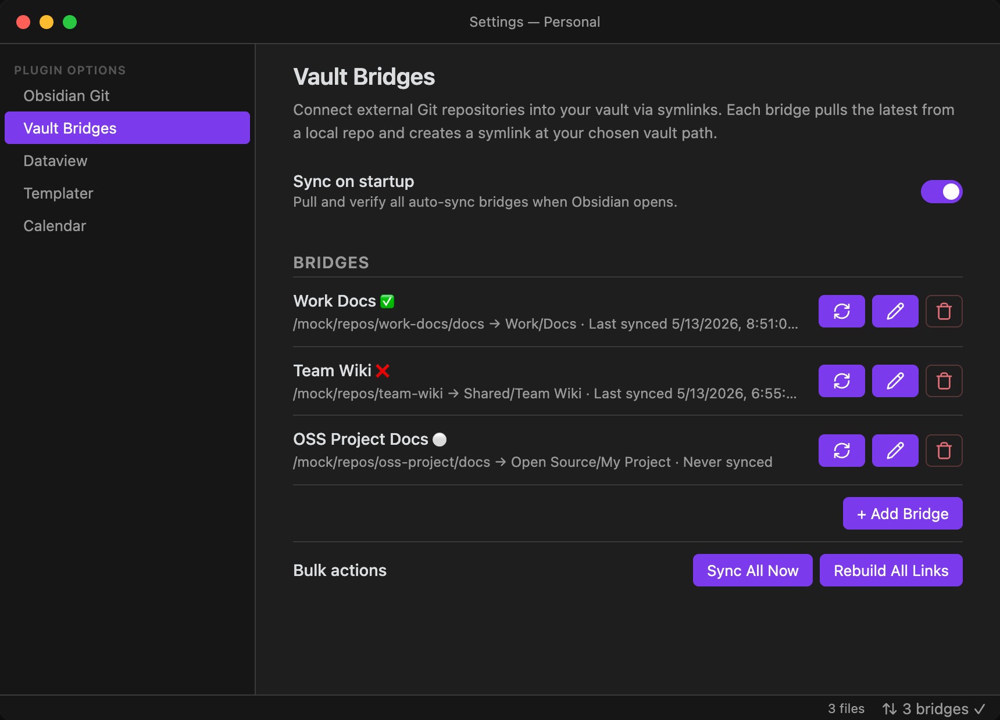
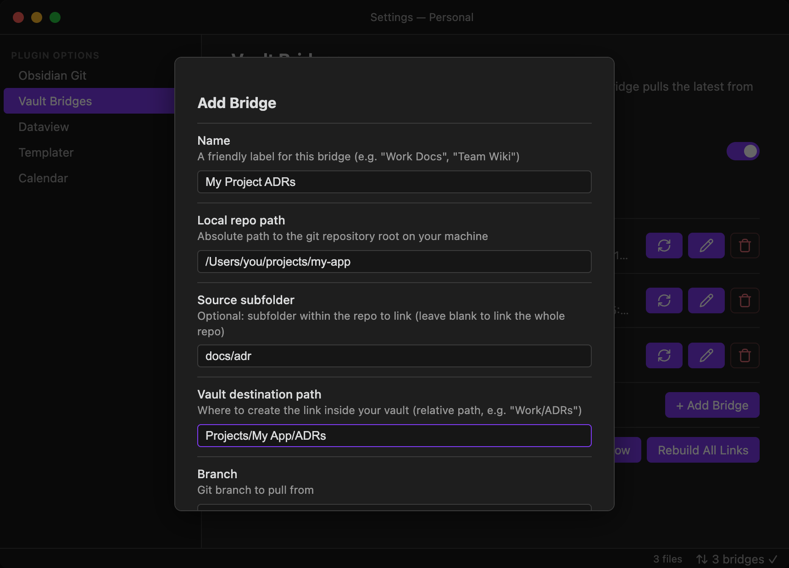

# Vault Bridges — Obsidian Plugin

**Connect external Git repositories into your vault with bidirectional sync.**

Vault Bridges lets you point at any locally-cloned Git repo (or a subfolder within one), pull the latest changes, and access those files directly inside Obsidian — as real files, fully searchable, linkable, and indexable. Edit them in Obsidian and push your changes back to Git with a single click.

---

## Screenshots





---

## Why Vault Bridges?

Obsidian is vault-bound by design. If you have notes, docs, or ADRs living in a Git repo outside your vault, your options are usually "copy them in manually" or "give up on linking them."

Vault Bridges adds a third option: a managed, bidirectional bridge that stays fresh. Each **bridge** is a named connection between a local repo (or subfolder) and a destination path in your vault. The plugin handles copying files in, pulling the latest from Git, and pushing your edits back — all from inside Obsidian.

**Common use cases:**
- Surfacing `docs/` or `ADRs/` from a work repo into your PKM
- Keeping a shared team knowledge base in sync
- Editing changelogs and READMEs from projects you maintain and committing changes back
- Linking dotfiles docs into your vault and pushing updates directly

---

## Features

- **Bidirectional sync** — pull from Git into your vault, or push edits from your vault back to the repo with a commit and push
- **Real file copies** — files are copied into the vault (not symlinked), so Obsidian fully indexes, searches, and links them
- **Dirty detection** — tracks file modifications since the last pull; warns before overwriting unsaved vault edits with a modal offering Push then Pull, Pull anyway, or Cancel
- **Safe auto-pull on startup** — skips dirty bridges on startup and notifies you instead of silently overwriting edits
- **Automatic legacy cleanup** — any old symlinks at a bridge destination are automatically replaced with real file copies on first sync
- **Subfolder support** — bridge a whole repo or just a subdirectory (e.g. `docs/adr`)
- **Per-bridge controls** — pull, push, edit, or remove each bridge independently; separate pulled/pushed timestamps at a glance
- **Bulk actions** — Pull All, Push All, and Rebuild All Copies from the settings panel
- **Status bar indicator** — see bridge health at a glance; click to open settings
- **Desktop only** — requires local filesystem access; mobile is not supported

---

## Installation

### Option 1: BRAT (recommended for beta users)

1. Install the [BRAT plugin](https://github.com/TfTHacker/obsidian42-brat) from the Obsidian community plugins list
2. Open BRAT settings → **Add Beta Plugin**
3. Enter: `richardbowman/obsidian-vault-bridges`
4. Enable **Vault Bridges** in Settings → Community Plugins

### Option 2: Manual

1. Download `main.js`, `manifest.json`, and `styles.css` from the [latest release](https://github.com/richardbowman/obsidian-vault-bridges/releases)
2. Create the folder `.obsidian/plugins/vault-bridges/` inside your vault
3. Copy the three files into that folder
4. Restart Obsidian and enable the plugin in Settings → Community Plugins

---

## Quick Start

1. Enable the plugin in **Settings → Community Plugins → Vault Bridges**
2. Open **Settings → Vault Bridges**
3. Click **+ Add Bridge**
4. Fill in:
   - **Name** — e.g. `Work Docs`
   - **Local repo path** — e.g. `/Users/you/projects/company-docs`
   - **Source subfolder** — e.g. `docs/adr` (leave blank for the whole repo)
   - **Vault destination** — e.g. `Work/ADRs`
   - **Branch** — default `main`
5. Save — the plugin will immediately pull from Git and copy the files into your vault

Your files now appear at `Work/ADRs` inside your vault as real, fully-indexed copies.

**To pull updates:** click the ⬇ (arrow-down-circle) button next to a bridge, or use **Pull All** / the `Vault Bridges: Sync All Bridges` command.

**To push edits back to Git:** click the ⬆ (arrow-up-circle) button next to a bridge. The plugin copies your vault files back to the repo, then runs `git add -A && git commit && git push origin <branch>`.

---

## Configuration Reference

### Settings Panel

| Setting | Description |
|---|---|
| **Sync on startup** | Pull all auto-sync bridges when Obsidian opens (pull only; push is always manual) |

### Per-Bridge Fields

| Field | Required | Description |
|---|---|---|
| **Name** | ✅ | Display label for this bridge |
| **Local repo path** | ✅ | Absolute path to the git repo root on your machine (must already be cloned) |
| **Source subfolder** | — | Subfolder within the repo to copy. Leave blank to copy the entire repo root |
| **Vault destination path** | ✅ | Relative path inside your vault where files will be copied |
| **Branch** | ✅ | Git branch to pull from and push to (default: `main`) |
| **Auto sync on startup** | — | Pull this specific bridge when Obsidian opens |

### Per-Bridge Controls

| Button | Action |
|---|---|
| ⬇ (arrow-down-circle) | **Pull** — `git pull` then copy repo files into the vault |
| ⬆ (arrow-up-circle) | **Push** — copy vault files back to the repo, then commit and push |
| Pencil | Edit this bridge's configuration |
| Trash | Remove this bridge (does not delete vault files) |

### Status Indicators

| Icon | Meaning |
|---|---|
| ✅ | Last sync succeeded |
| ❌ | Last sync failed — hover or open settings to see the error |
| 🔄 | Currently syncing |
| ⚪ | Never synced |

---

## Commands

Access via **Cmd/Ctrl+P**:

| Command | Description |
|---|---|
| `Vault Bridges: Sync All Bridges` | Pull all bridges (git pull + copy files into vault) |
| `Vault Bridges: Push All Bridges` | Push all bridges (copy vault files to repo, commit, and push) |
| `Vault Bridges: Rebuild All Copies` | Re-copy all files from repos into the vault — useful after moving the vault or if files get out of sync |

Individual bridge pull and push are also available from the **Settings → Vault Bridges** panel via the per-bridge buttons.

---

## Known Limitations

- **Repo must be cloned locally** — the plugin does not clone repos from a URL. You need to have the repo on disk already.
- **No mobile support** — requires local filesystem access not available on Obsidian Mobile.
- **Vault move** — if you move your vault, run `Vault Bridges: Rebuild All Copies` to re-copy files at the new location.
- **Obsidian Git coexistence** — if your vault is itself a git repo managed by Obsidian Git, add your bridge destination paths to the vault's `.gitignore` to prevent double-tracking.

---

## Development

```bash
git clone https://github.com/richardbowman/obsidian-vault-bridges
cd obsidian-vault-bridges
npm install

# Watch mode — rebuilds on every save
npm run dev

# Type-check only
npm run typecheck

# Production build + copy to vault
npm run deploy
```

The plugin is written in TypeScript and uses esbuild for bundling. Source files live in `src/`; the entry point is `main.ts`.

See [Development Guide](docs/development.md) for architecture details, adding new features, and testing.

---

## Contributing

Issues and PRs welcome. If you have a use case that isn't covered — clone-from-URL, sync scheduling, conflict resolution — please open an issue first to discuss the approach before building.

---

## License

MIT © Rick Bowman
